# Sovereign AI SOC


[](https://github.com/bluesaphire76/sovereign-ai-soc/actions/workflows/dependabot/update-graph)
[](https://github.com/bluesaphire76/sovereign-ai-soc/actions/workflows/github-code-scanning/codeql)
[](https://github.com/bluesaphire76/sovereign-ai-soc/actions/workflows/ci.yml)


Sovereign AI SOC is a local-first AI-powered security operations platform combining Wazuh, Suricata, correlation-first incident detection, local AI analysis, investigation intelligence, human-governed remediation, case workflow, executive reporting and human-in-the-loop security operations.

It is built as a product-grade prototype for teams that want AI-assisted SOC workflows without making external AI providers a mandatory dependency for sensitive security data.

## Product Preview

Sovereign AI SOC is a local-first, human-in-the-loop security operations platform that combines detection, AI-assisted investigation, case workflow, governance and observability.

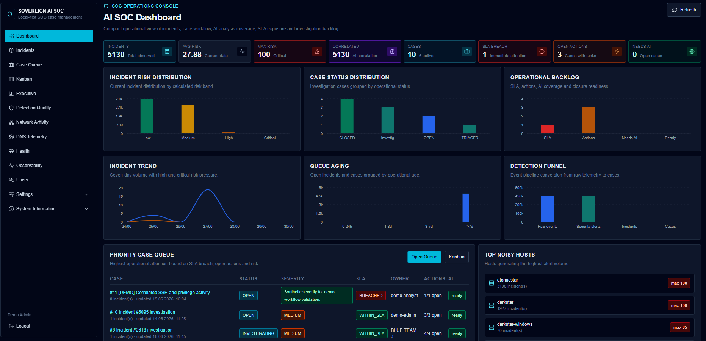

The platform provides a high-level operational view across incidents, risk posture, workflow readiness and platform health, giving both analysts and stakeholders an immediate understanding of the security operations picture.

---

### SOC Operations

<table>
  <tr>
    <td width="50%">
      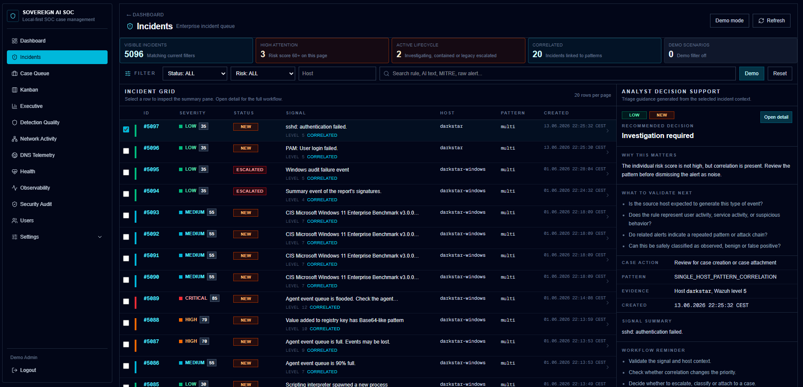
      <br>
      <strong>Incidents Workbench</strong>
      <br>
      Prioritized security incidents with lifecycle, severity, source and investigation context.
    </td>
    <td width="50%">
      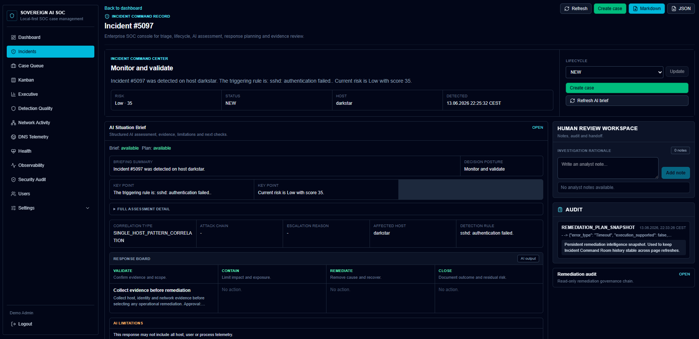
      <br>
      <strong>AI-assisted Incident Analysis</strong>
      <br>
      Local AI supports the analyst with risk rationale, evidence summary and recommended checks.
    </td>
  </tr>
  <tr>
    <td width="50%">
      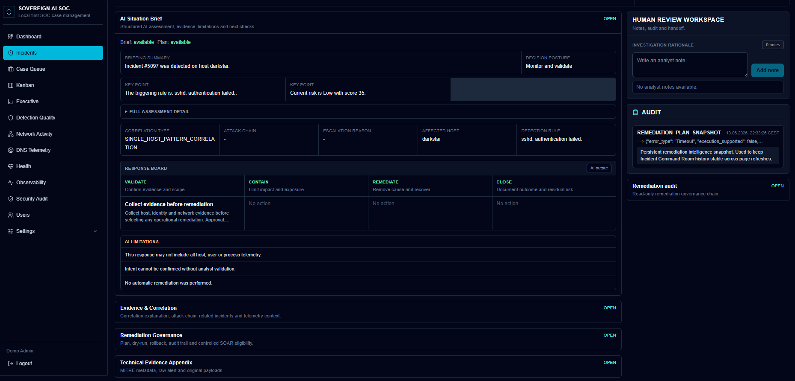
      <br>
      <strong>AI Situation Brief</strong>
      <br>
      Executive-style incident context, decision support and analyst-oriented summary.
    </td>
    <td width="50%">
      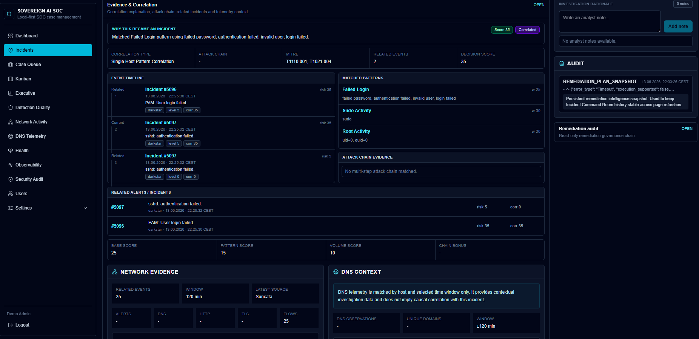
      <br>
      <strong>Correlation Timeline & Attack Chain</strong>
      <br>
      Related alerts, evidence, MITRE context and explainable incident correlation.
    </td>
  </tr>
</table>

---

### Response Workflow & Governance

<table>
  <tr>
    <td width="50%">
      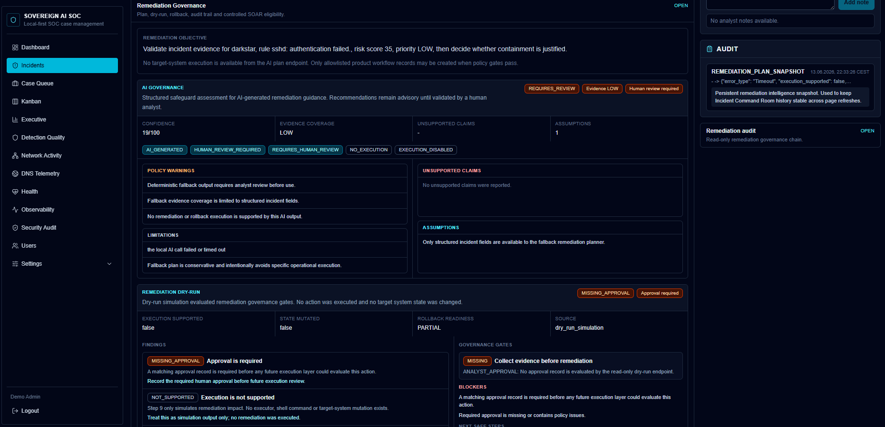
      <br>
      <strong>Remediation Governance</strong>
      <br>
      Recommended actions remain governed, reviewable and human-approved.
    </td>
    <td width="50%">
      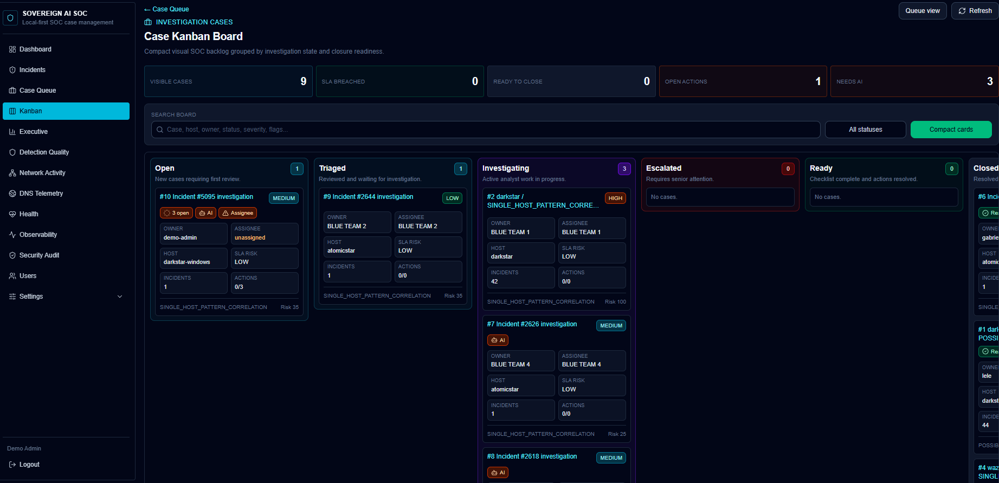
      <br>
      <strong>Case Kanban & SLA Workflow</strong>
      <br>
      Human-in-the-loop case management with ownership, SLA and closure readiness.
    </td>
  </tr>
</table>

---

### Detection Quality & Control Plane

<table>
  <tr>
    <td width="50%">
      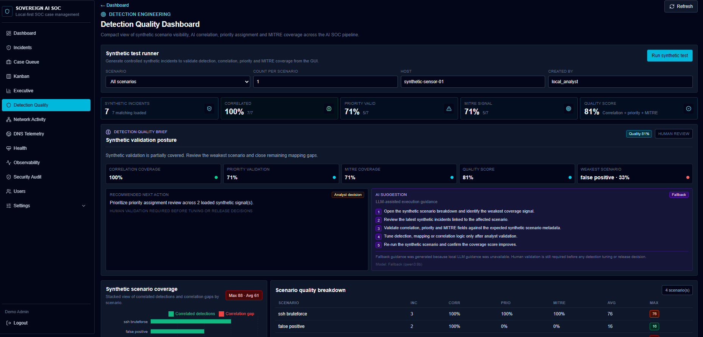
      <br>
      <strong>Detection Quality Validation</strong>
      <br>
      Synthetic scenario validation, detection coverage and analyst-oriented next actions.
    </td>
    <td width="50%">
      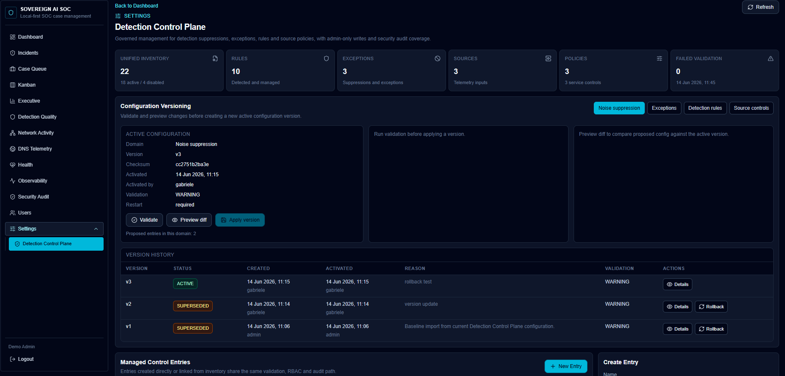
      <br>
      <strong>Detection Control Plane</strong>
      <br>
      Operational governance for rules, exceptions, suppression and detection policies.
    </td>
  </tr>
</table>

---

### Platform Health & Observability

<table>
  <tr>
    <td width="50%">
      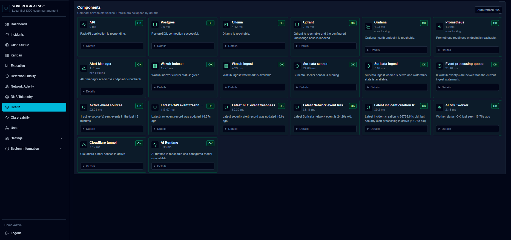
      <br>
      <strong>Platform Health</strong>
      <br>
      Runtime visibility across AI, ingestion, Wazuh, Suricata, database and workers.
    </td>
    <td width="50%">
      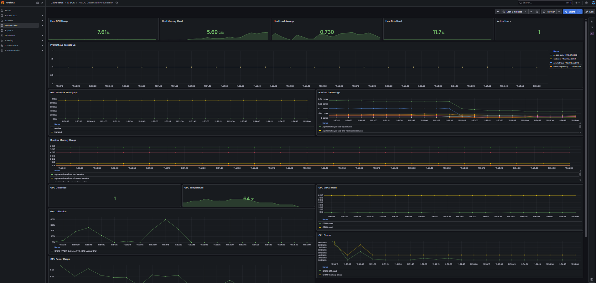
      <br>
      <strong>Grafana Observability</strong>
      <br>
      Historical metrics for the AI SOC platform, infrastructure and runtime components.
    </td>
  </tr>
</table>

## Additional Product Views

Additional screenshots are available in [`docs/assets/screenshots`](docs/assets/screenshots), including technical evidence, control plane inventory and extended observability views.

## How the Platform Works

1. Security events are collected from local detection sources such as Wazuh and Suricata.
2. The ingestion pipeline normalizes, deduplicates and suppresses known operational noise.
3. Relevant signals are correlated into explainable incidents.
4. Local AI supports the analyst with risk rationale, evidence summary, recommended checks and remediation guidance.
5. The analyst remains in control through human-in-the-loop case workflow and approval gates.
6. Health and observability views provide operational confidence across the platform.

## Why Sovereign AI SOC

SOC teams need faster interpretation, clearer evidence handling and better decision support. Security data is also sensitive: raw alerts, hostnames, commands, DNS lookups, IDS events and case notes often cannot be sent to external services without policy review.

Sovereign AI SOC demonstrates a local-first approach:

- Security telemetry stays in the local environment.
- AI analysis runs through a local Ollama runtime.
- Deterministic ingestion, suppression and correlation decide what becomes an incident.
- Analysts remain in control of escalation, response, case closure and reporting.
- Reports and evidence packs are generated locally for audit and executive communication.

## Key Capabilities

| Area | Capability |
|---|---|
| Detection sources | Wazuh host/security monitoring, Suricata network IDS visibility and DNS telemetry context |
| Event model | Separation between raw events, security alerts, incidents and cases |
| Ingestion quality | Aggregation, deduplication, watermarking, backlog tracking and noise suppression |
| Incident creation | Correlation-first logic before incident creation, with observed-only and suppressed paths |
| Incident workflow | Incident Command Center, lifecycle updates, analyst notes, AI Situation Brief, correlation visualization and evidence context |
| Case workflow | Ownership, SLA posture, closure readiness, linked incidents, Kanban and case AI analysis |
| AI workflow | Incident analysis, Command Brief, risk rationale, evidence summaries, configurable local LLM model routing, recommended actions and HOW TO EXECUTE guidance |
| Remediation workflow | LLM-backed remediation intelligence, approval gates, dry-run simulation, rollback readiness, execution audit trail, replay simulation and controlled internal workflow actions |
| Detection engineering | Detection Quality dashboard, synthetic scenarios, coverage posture and AI-generated remediation suggestions |
| Executive workflow | Executive dashboard, executive insights, decision brief and concise management reporting |
| Reporting | Incident reports, case reports, evidence packs, executive PDFs and professional export naming |
| Governance | RBAC for ADMIN, ANALYST and VIEWER, Security Audit, user management and session hardening |
| Observability | Enterprise Health page plus a dedicated Grafana/Prometheus observability layer with historical platform metrics, worker and ingest telemetry, source freshness, AI runtime status, active users, GPU/runtime visibility, SOC pipeline quality, AI triage outcomes and noise reduction insights |

## AI Capabilities

AI is used across the workflow, not only for triage.

- Incident AI analysis for situation summaries, risk rationale and evidence interpretation.
- Structured Local AI Command Brief for analyst-facing decision support.
- Evidence summaries that connect raw alert context, correlation data, network evidence and DNS context without inventing causality.
- Recommended actions and remediation guidance, including AI-generated HOW TO EXECUTE steps for detection quality recommendations.
- Case analysis, open gaps, decision points and workflow support.
- Correlation explanation to help answer why an event became an incident.
- Detection Quality assistance for synthetic scenarios, weak coverage areas and next recommended action.
- LLM-backed remediation intelligence with governance labels, approval requirements, dry-run, rollback readiness and replay simulation.
- Controlled SOAR support for allowlisted internal workflow actions such as remediation tasks, notes, case actions and audit records.
- Executive insights and report enrichment for management-ready summaries.
- Runtime observability, timeout handling, deterministic fallback and visible LLM profile/model metadata when the local model is unavailable or routed by task.

The platform does not autonomously execute destructive or external operational response actions. AI provides interpretation, recommendations and draft guidance; the analyst remains responsible for validation and action. Controlled SOAR execution is limited to safe internal product workflow records unless future connector/playbook integrations are explicitly added and governed.

See [AI Capabilities](docs/ai-capabilities.md) for the full model.

## Detection Sources

Sovereign AI SOC combines host, security and network visibility:

- **Wazuh** provides endpoint/security monitoring, host context, agent state, rules, levels and security findings.
- **Suricata** provides network IDS visibility through normalized network events.
- **DNS telemetry** provides endpoint DNS context matched by host/client IP and time window. DNS context is contextual telemetry only and does not imply causal correlation with an incident.
- **Internal normalization** separates raw events, security alerts, incidents and cases so that each workflow has a clear responsibility.

See [Detection Sources](docs/detection-sources.md).

## Human-in-the-loop by Design

The product is designed for analyst-controlled security operations:

- Deterministic policy determines suppression, correlation and incident creation.
- AI explains, summarizes and recommends.
- Analysts decide escalation, ownership, response, closure and reporting.
- Remediation remains human-governed through approval, dry-run, rollback readiness and audit trail checks.
- Controlled SOAR actions are limited to allowlisted internal workflow records; external host, identity, firewall or endpoint changes are not executed.
- Admin-only areas such as Security Audit and user management remain protected by RBAC.
- Evidence packs and audit trails preserve accountability.

## Local-first Architecture

The core runtime is local:

- Browser and Next.js frontend.
- FastAPI backend.
- PostgreSQL operational datastore.
- Wazuh and Suricata signal sources.
- Local Ollama/LLM runtime.
- Local report and evidence pack generation.
- Nginx and systemd deployment for production-style demo environments.

No mandatory external AI provider is required for the core product flow.

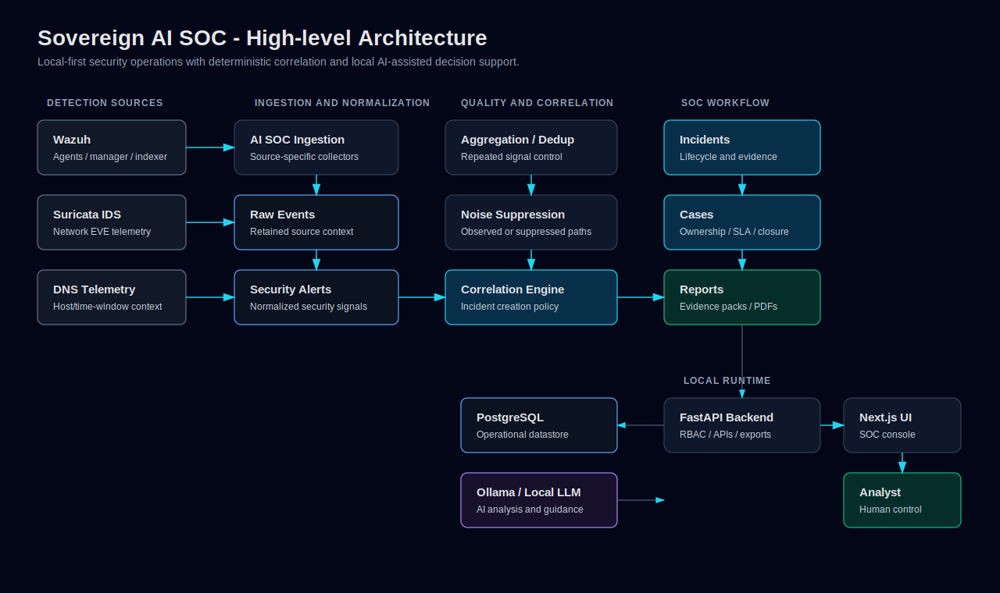

More complete diagrams are available in [Architecture](docs/architecture.md), with editable Mermaid sources in [docs/diagrams](docs/diagrams).

## Demo Flow

A concise product demo can follow this path:

1. Open the Dashboard or Executive Dashboard to show SOC posture.
2. Review active incidents, risk distribution and operational health.
3. Open a correlated incident in the Incident Command Room.
4. Explain the AI Command Brief, risk rationale, evidence summary and recommended actions.
5. Review Remediation Governance, replay simulation and controlled internal workflow action eligibility.
6. Inspect Correlation Visualization to show why the platform created the incident.
7. Review endpoint DNS context or Suricata network evidence where available.
8. Open Detection Quality and show synthetic scenario coverage plus AI-generated remediation guidance.
9. Create or open a case, assign ownership, review SLA posture and closure readiness.
10. Generate an incident report, case report or analyst evidence pack.
11. Open Health, Grafana Observability and Security Audit to show operational observability and governance.

See [Demo Guide](docs/demo-guide.md) for presenter talking points.

## Quick Start / Demo Start

The repository is designed for a local lab or product demo environment. Runtime values are configured through `.env`, which must never be committed.

See [INSTALL.md](INSTALL.md) for the complete local installation and
10-minute demo-readiness workflow.

```bash
git clone <repository-url>
cd <repository-directory>
```

Use the guided local installer after reviewing its dry-run plan:

```bash
./ai-soc install --profile demo --dry-run
./ai-soc install --profile demo --apply
```

This is a local preparation helper, not a production installer. Apply mode
installs dependencies and initializes `.env` safely, but does not start
services, containers, demo data or Ollama model downloads.

Initialize a local configuration without overwriting an existing `.env`, then run the readiness and public validation checks:

```bash
./ai-soc init --profile demo
./ai-soc doctor
./ai-soc validate
./ai-soc validate-runtime
./ai-soc demo-seed --dry-run
./ai-soc demo-seed --apply
./ai-soc demo-info
./ai-soc demo-reset --dry-run
./ai-soc demo-validate
./ai-soc demo-status
./ai-soc demo-up --dry-run
./ai-soc demo-up --apply
./ai-soc demo-down --dry-run
./ai-soc demo-down --apply
```

Review the generated `.env` and set environment-specific PostgreSQL, Wazuh and local runtime values before starting services.

`validate-runtime` performs read-only checks against a running local instance.
`demo-seed` uses dry-run mode by default and creates clearly marked synthetic
demo records only when `./ai-soc demo-seed --apply` is used. `demo-validate`
is read-only, never seeds data, and can optionally write an ignored local
validation artifact with `./ai-soc demo-validate --write-report`.

`demo-status` is read-only. `demo-up`, `demo-down` and `demo-restart`
default to a dry run and modify service state only when `--apply` is passed.
They manage only the local `ai-soc-api` and `ai-soc-frontend` application
services, not Wazuh, Suricata, PostgreSQL, Qdrant, Grafana, Prometheus,
Alertmanager, Loki, Ollama or Docker Compose. If systemd permissions are
required, the lifecycle helper fails safely and prints the manual commands.

Before publishing or sharing a release, run the read-only release checker:

```bash
./ai-soc release-check
./ai-soc release-check --full
./ai-soc release-check --write-report
```

The default check is lightweight and does not write files. `--full` also runs
the backend test suite, frontend production build and Docker Compose
configuration validation. `--write-report` stores ignored local Markdown and
JSON artifacts under `reports/validation/`.

The controlled Docker demo foundation includes the API, frontend, PostgreSQL,
Qdrant and Ollama without claiming a full production deployment:

```bash
./ai-soc package-validate
./ai-soc package-validate --build
```

The default packaging validation does not build or run containers. The build
mode creates local application images only; Ollama models are selected and
downloaded manually. See
[Docker Demo Packaging Foundation](docs/docker-demo-packaging.md).

Create an initial admin user after backend dependencies and database connectivity are available:

```bash
AI_SOC_ADMIN_USERNAME=admin \
AI_SOC_ADMIN_PASSWORD='<set-a-strong-password>' \
AI_SOC_ADMIN_DISPLAY_NAME='SOC Administrator' \
python3 scripts/create_default_admin_user.py
```

Development commands used by the project:

```bash
# Backend, from repository root after installing local Python dependencies.
PYTHONPATH=. .venv/bin/uvicorn api:app --host 127.0.0.1 --port 8008

# Frontend.
cd frontend
npm install
npm run build
npm run start
```

Optional local knowledge base indexing for Qdrant-backed RAG:

```bash
# Recreate the configured collection and index Markdown files from knowledge_base/.
PYTHONPATH=. .venv/bin/python rag_index.py --recreate
```

The AI triage, incident brief, case analysis and bounded investigation retrieval paths can use the configured `QDRANT_COLLECTION` for contextual SOC playbook evidence. The Health page reports `WARN` when Qdrant is reachable but the configured knowledge base collection is missing or empty.

Production-style demo deployments in this repository use Nginx and systemd service names already documented in `deploy/`:

```bash
sudo systemctl restart ai-soc-api
sudo systemctl restart ai-soc-frontend
sudo systemctl status ai-soc-api --no-pager
sudo systemctl status ai-soc-frontend --no-pager
```

Suricata and DNS telemetry have dedicated deployment artifacts:

- `deploy/systemd/ai-soc-suricata-ingest.service`
- `deploy/systemd/ai-soc-dns-collector.service`
- `deploy/suricata/docker-compose.yml`

See [Deployment Guide](docs/deployment-guide.md) for a fuller operational view.

## Public CI Validation

GitHub Actions validates backend tests and Python syntax, the frontend production build, and public Docker Compose configuration syntax without starting runtime services.
The public CI workflow also runs safe `./ai-soc` CLI smoke checks that do not
require local runtime services.

Run the lightweight repository baseline check locally:

```bash
python3 scripts/validate_public_ci_baseline.py
```

## Documentation Index

- [Product Overview](docs/product-overview.md)
- [Architecture](docs/architecture.md)
- [Installation and Demo Guide](INSTALL.md)
- [AI Capabilities](docs/ai-capabilities.md)
- [Detection Sources](docs/detection-sources.md)
- [Ingestion and Correlation Pipeline](docs/ingestion-correlation-pipeline.md)
- [User Guide](docs/user-guide.md)
- [Admin Guide](docs/admin-guide.md)
- [Demo Guide](docs/demo-guide.md)
- [Deployment Guide](docs/deployment-guide.md)
- [Docker Demo Packaging Foundation](docs/docker-demo-packaging.md)
- [Security Model](docs/security-model.md)
- [Reporting Guide](docs/reporting-guide.md)
- [Observability Architecture and Operations Guide](docs/v0.6.0-observability.md)
- [v0.6.0 Release Notes](docs/releases/RELEASE_NOTES_v0.6.0.md)
- [v0.6 Release Checklist](docs/v0.6-release-checklist.md)
- [Roadmap](docs/roadmap.md)
- [Screenshot Checklist](docs/assets/screenshots/README.md)
- [Architecture Asset Notes](docs/assets/architecture/README.md)


Existing release and validation notes:

- [Release Notes v0.4.0](docs/releases/RELEASE_NOTES_v0.4.0.md)
- [Release Notes v0.2.0-rc1](docs/releases/RELEASE_NOTES_v0.2.0-rc1.md)
- [v0.3 Release Notes](docs/v0.3-release-notes.md)
- [v0.4 Release Checklist](docs/v0.4-release-checklist.md)
- [v0.5 Demo Scenario Pack](docs/v0.5-demo-scenario-pack.md)
- [v0.5 Suricata Network Telemetry](docs/v0.5-suricata-network-telemetry.md)
- [v0.5 DNS Telemetry Pilot](docs/v0.5-dns-telemetry-pilot.md)
- [v0.7 Expanded Validation Harness](docs/v0.7-expanded-validation-harness.md)
- [v0.7 External AI Provider Abstraction](docs/v0.7-external-ai-provider-abstraction.md)
- [v0.7 AI Data Control Policy](docs/v0.7-ai-data-control-policy.md)

## Roadmap

| Version | Status | Focus |
|---|---:|---|
| v0.2 | Completed | Initial SOC platform, incident views, synthetic scenarios and detection quality foundation |
| v0.3 | Completed | RBAC, user management, Security Audit, session hardening, Nginx headers and PostgreSQL upgrade |
| v0.4 | Completed | Ingestion quality, event separation, correlation-first incident creation, noise suppression, AI hardening, reporting and observability |
| v0.5 | Completed | Demo scenario pack, enterprise UX, Incident Command Room, case workflow, report/export polish, Suricata, DNS context and correlation visualization |
| v0.6 | Released | AI investigation intelligence, human-governed remediation, Incident Command Center rewrite, replay simulation, controlled internal SOAR workflow actions and observability improvements |
| v0.7 | Candidate | Additional connectors, deeper case collaboration, stronger reporting automation and broader validation tooling |

See [Roadmap](docs/roadmap.md).

## License

Apache License 2.0. See [LICENSE](LICENSE).
