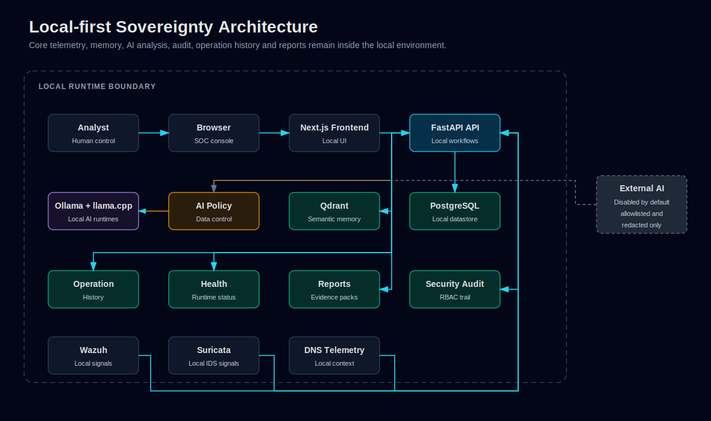

# Architecture

Sovereign AI SOC uses a local-first architecture with a Next.js frontend, FastAPI backend, PostgreSQL datastore, Wazuh and Suricata signal sources and an Ollama-backed local AI runtime.

## System Overview

Editable Mermaid source: [high-level-architecture.mmd](diagrams/high-level-architecture.mmd).

## Components

| Component | Role |
|---|---|
| Next.js frontend | Enterprise SOC console for dashboards, incidents, cases, detection quality, health and admin workflows. |
| FastAPI backend | API layer for incidents, cases, reports, AI briefings, health, RBAC and telemetry access. |
| PostgreSQL | Operational storage for normalized events, alerts, incidents, cases, users, audit and report metadata. |
| Wazuh | Host and endpoint security monitoring source. |
| Suricata | Network IDS source normalized into network events. |
| DNS telemetry | Endpoint DNS context normalized into `dns_events`. |
| Ollama | Local AI runtime used for analysis, summaries and guidance. |
| Nginx | TLS reverse proxy and security headers for production-style demo deployments. |
| systemd workers | Runtime management for API, frontend and ingestion workers. |

## Data Flow

1. Wazuh, Suricata and DNS collectors produce telemetry.
2. Ingestion normalizes telemetry into internal storage.
3. Raw events and security alerts remain separate from incidents.
4. Aggregation and deduplication reduce repeated signals.
5. Noise suppression prevents known low-value findings from becoming incidents.
6. Correlation-first policy decides whether an incident should be created.
7. Incidents can become cases with ownership, SLA and closure workflow.
8. AI analysis is generated after deterministic policy decisions.
9. Reports and evidence packs are generated from stored operational context.

See [Ingestion and Correlation Pipeline](ingestion-correlation-pipeline.md).

## Storage Model

The platform separates operational concepts:

- `raw_events`: ingested source-level telemetry.
- `security_alerts`: normalized security alerts derived from source events.
- `incidents`: analyst-facing correlated work items.
- `cases`: multi-incident workflow containers with ownership and closure state.
- `network_events`: Suricata-derived IDS visibility.
- `dns_events`: contextual DNS telemetry.
- audit/user tables: RBAC and governance.

This separation keeps reporting, workflow and detection logic clear.

## AI Runtime Role

The local AI runtime supports:

- Incident AI analysis.
- Local AI Command Brief generation.
- Risk rationale and evidence summaries.
- Recommended actions and HOW TO EXECUTE guidance.
- Case analysis.
- Detection Quality remediation suggestions.
- Executive insight and report enrichment.

AI does not decide access control, mutate lifecycle state by itself, or execute response actions. See [AI Capabilities](ai-capabilities.md).

## Local-first Sovereignty View

Editable Mermaid source: [local-first-sovereignty-architecture.mmd](diagrams/local-first-sovereignty-architecture.mmd).

## Deployment Model

The repository includes deployment artifacts for:

- Nginx reverse proxy and security headers.
- FastAPI API service.
- Next.js frontend service.
- Suricata EVE ingest worker.
- DNS collector worker.
- PostgreSQL lab runtime.
- Ollama local runtime.

See [Deployment Guide](deployment-guide.md). Editable Mermaid source: [deployment-architecture.mmd](diagrams/deployment-architecture.mmd).

## Human-in-the-loop Boundaries

Human operators control:

- Incident escalation and status changes.
- Case ownership, SLA handling and closure.
- Interpretation and validation of AI recommendations.
- Operational response actions.
- Report review and distribution.

The architecture is intentionally AI-assisted, not analyst-replacing.
