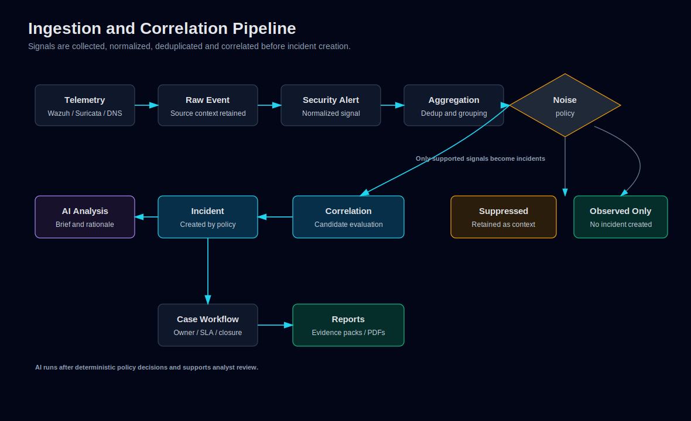

# Ingestion and Correlation Pipeline

The ingestion pipeline is designed to preserve raw security context while preventing noisy or duplicated telemetry from overwhelming the SOC workflow.

Editable Mermaid source: [ingestion-correlation-pipeline.mmd](../diagrams/ingestion-correlation-pipeline.mmd).

## Core Entities

| Entity | Purpose |
|---|---|
| Raw event | Source-level event captured from Wazuh, Suricata or related collectors. |
| Security alert | Normalized security-relevant signal derived from raw events. |
| Incident | Analyst-facing work item created after deterministic policy and correlation. |
| Case | Investigation container for one or more incidents with ownership, SLA and closure state. |

## Pipeline Stages

1. **Collect** telemetry from Wazuh, Suricata and DNS paths.
2. **Normalize** source-specific payloads into internal tables.
3. **Aggregate and deduplicate** repeated observations.
4. **Suppress noise** that should not become SOC incidents.
5. **Evaluate correlation candidates** using score, type, recent volume, attack chain and related context.
6. **Create incidents** only when policy supports escalation.
7. **Attach AI analysis** and briefings for analyst review after provider/data
   policy checks.
8. **Retrieve advisory semantic context** such as playbooks or similar
   historical incidents.
9. **Promote into cases** when investigation workflow is needed.
10. **Visualize** linked records through the Advanced Timeline and
    Investigation Graph.

## Observed, Suppressed or Incident-created

Not every signal should become an incident:

- **Observed only**: retained for context and reporting.
- **Suppressed**: explicitly prevented from becoming an incident based on policy.
- **Incident created**: promoted because severity, correlation or operational context warrants analyst action.

This model is important for vulnerability/package findings and other high-volume signals that may be better handled as vulnerability-management context than SOC incidents.

## Noise Suppression

Noise suppression prevents known low-value telemetry from creating incident
backlog. v0.7 exposes governed suppression and exception inventory, match
previews, review dates, lifecycle validation, configuration versioning and
rollback. These controls remain deterministic and auditable.

The platform must not reintroduce behavior that treats routine Wazuh vulnerability/package findings as direct SOC incidents.

## Correlation-first Logic

Correlation-first incident creation considers:

- Source severity and risk.
- Correlation score.
- Correlation type.
- Recent event volume.
- Related events.
- Attack chain and MITRE metadata where available.

This allows the product to explain why an incident exists rather than simply displaying every alert.

## AI Placement

AI and Qdrant are used after deterministic policy decisions. They support
explanation, retrieval, summarization and next-action guidance; they do not
replace suppression, correlation, severity or closure policy.

## Worker and Backlog Metrics

Health and operational pages expose worker posture, ingest freshness, backlog
thresholds and runtime availability. Prometheus rules can route Wazuh backlog
alerts through Alertmanager, while Loki/Alloy provide selected platform-log
troubleshooting. Operation History separately records governed service checks
and restart activity.
