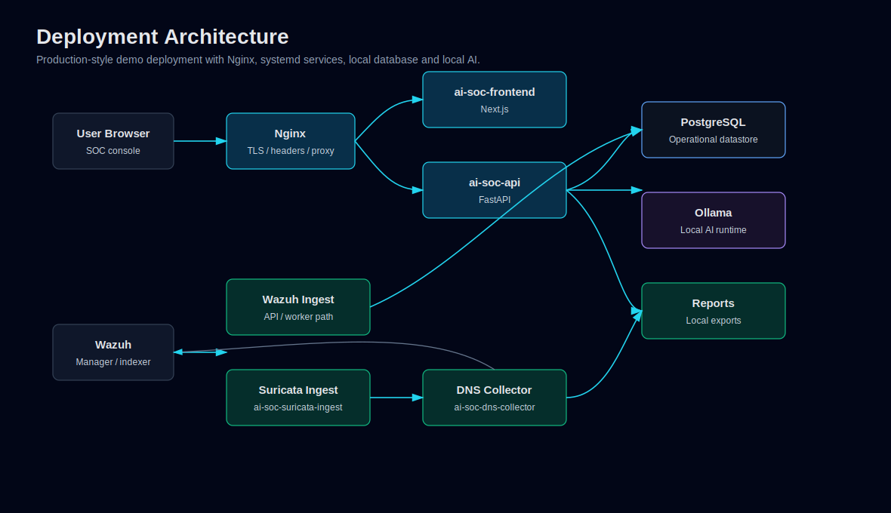

# Deployment Guide

Sovereign AI SOC is intended for local lab and production-style demo deployments. The repository includes Nginx, systemd and collector artifacts that support that model.



Editable Mermaid source: [deployment-architecture.mmd](diagrams/deployment-architecture.mmd).

## Runtime Components

| Component | Typical role |
|---|---|
| Nginx | TLS termination, reverse proxy and security headers. |
| Next.js frontend | SOC user interface on port `3000` behind Nginx. |
| FastAPI backend | API service on port `8008` behind Nginx. |
| PostgreSQL | Operational datastore. |
| Qdrant | Local vector knowledge base for SOC playbook context used by RAG-enabled AI workflows. |
| Wazuh | Host/security telemetry source. |
| Suricata | Network IDS telemetry source. |
| Ollama | Local AI runtime. |
| systemd workers | API, frontend and ingestion process management. |

The SVG above is committed so the architecture remains visible in Markdown viewers that do not render Mermaid directly.

## Configuration

Start from `.env.example`:

```bash
cp .env.example .env
```

Set local values for:

- Wazuh indexer URL and credentials.
- PostgreSQL host, database, user and password.
- Qdrant URL, collection and knowledge base path if RAG context is enabled.
- Ollama model and base URL.
- Authentication secret.
- Ingestion and health thresholds.
- Retention policy.

Never commit `.env`.

## Frontend

The frontend is under `frontend/`:

```bash
cd frontend
npm install
npm run build
npm run start
```

The deployed service is represented by `ai-soc-frontend` in existing systemd documentation.

## Backend

The backend is FastAPI:

```bash
PYTHONPATH=. .venv/bin/uvicorn api:app --host 127.0.0.1 --port 8008
```

The deployed service is represented by `ai-soc-api`.

## Qdrant Knowledge Base

Qdrant-backed RAG is configured with `AI_SOC_RAG_ENABLED`, `QDRANT_URL`, `QDRANT_COLLECTION` and `QDRANT_KNOWLEDGE_BASE_PATH`.

Index local Markdown playbooks into the configured collection:

```bash
PYTHONPATH=. .venv/bin/python rag_index.py --recreate
```

The Health page reports Qdrant as `WARN` when the service is reachable but the configured collection is missing or empty.

## Nginx

Nginx configuration exists under `deploy/nginx/` and includes:

- Local TLS proxying.
- `/api-backend/` routing to FastAPI.
- `/reports/` routing for generated report access.
- Security headers.
- Cache controls for sensitive pages.

## Ingestion Workers

Suricata ingest:

- `deploy/systemd/ai-soc-suricata-ingest.service`
- `workers/suricata_ingest_worker.py`
- `scripts/ingest_suricata_eve.py`

DNS collector:

- `deploy/systemd/ai-soc-dns-collector.service`
- `deploy/dns/ai-soc-dns-collector.py`
- `scripts/ingest_dns_events_from_wazuh.py`

## Service Operations

```bash
sudo systemctl restart ai-soc-api
sudo systemctl restart ai-soc-frontend
sudo systemctl status ai-soc-api --no-pager
sudo systemctl status ai-soc-frontend --no-pager
```

Optional worker checks:

```bash
sudo systemctl status ai-soc-suricata-ingest --no-pager
sudo systemctl status ai-soc-dns-collector --no-pager
```

## Validation

After deployment or restart:

1. Open `/health`.
2. Confirm API, PostgreSQL and Qdrant are healthy.
3. Confirm Wazuh/Suricata/DNS freshness if those sources are expected.
4. Confirm Ollama/local AI runtime status.
5. Open `/incidents`, `/executive` and `/detection-quality`.
6. Generate a report only with clean demo data.
