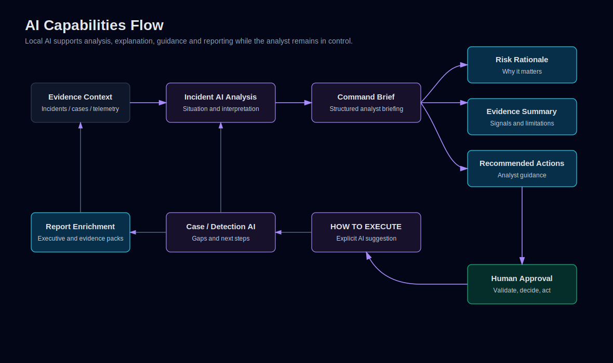

# AI Capabilities

Sovereign AI SOC uses AI as a multi-stage decision support capability across incident, case, detection quality, executive and reporting workflows.

AI is not limited to triage. It helps interpret evidence, explain correlation, draft next actions, generate execution guidance and enrich reports while preserving human control.

Editable Mermaid source: [ai-capabilities-flow.mmd](../diagrams/ai-capabilities-flow.mmd).

## 1. Overview

The AI layer is designed around evidence-based support:

- Input comes from incidents, raw alert context, correlation summaries, cases, detection quality data and selected telemetry context.
- Output is structured for analyst review.
- Timeout and fallback behavior keeps the product usable when the local runtime is unavailable.
- AI output is never treated as an automatic operational command.

## 2. Local AI Runtime

The platform uses Ollama as the local LLM runtime. Runtime configuration is controlled through `.env` values such as `OLLAMA_MODEL`, `OLLAMA_BASE_URL` and the `AI_SOC_LLM_*` profile routing settings.

The routing policy selects a model profile by task, severity and whether the action is user-triggered. The intent is to load the appropriate model when needed, not to keep every configured model active at the same time.

The Health page and observability metrics expose AI runtime details, including configured model, last LLM profile/model and fallback status where available.

## 3. Incident AI Analysis

Incident analysis helps answer:

- What happened?
- Why does it matter?
- What evidence supports the assessment?
- What should an analyst validate next?
- What limitations or uncertainty remain?

Incident AI analysis is grounded in incident fields, raw alert context, correlation summaries, notes and available evidence.

## 4. Local AI Command Brief

The Command Brief converts raw operational context into a structured analyst briefing:

- Situation summary.
- Risk rationale.
- Evidence summary.
- Recommended actions.
- Confidence and limitations.
- Human validation requirements.

It is designed for fast analyst comprehension, not automated response.

## 5. Risk Rationale and Evidence Summary

AI-generated risk rationale explains why a signal may matter in operational terms. Evidence summaries help connect:

- Wazuh rule and level.
- Correlation score and type.
- Attack chain or MITRE metadata when present.
- Related events.
- Network evidence.
- DNS context, clearly labeled as contextual telemetry only.

The system avoids implying causality from DNS context alone.

## 6. Recommended Actions

Recommended actions are analyst guidance, such as:

- Validate affected host state.
- Review related alerts and timeline.
- Confirm whether activity is expected.
- Check containment prerequisites.
- Open or update a case.
- Review detection coverage gaps.

Actions are suggestions. The analyst decides what to do.

## 7. Remediation Intelligence and Governance

v0.6 adds LLM-backed remediation intelligence for analyst review. The remediation workflow can produce:

- remediation objectives and containment strategy;
- recommended actions with evidence basis;
- approval requirements;
- business impact and rollback considerations;
- assumptions, limitations and unsupported claims;
- AI governance status, confidence and safety labels.

This output is advisory. It is evaluated by deterministic governance checks and remains human-reviewed even when generated by a local LLM.

## 8. Remediation Simulation and Controlled SOAR

The remediation workflow includes approval gates, dry-run simulation, rollback readiness, execution audit trail and replay simulation.

Controlled SOAR execution is intentionally narrow. It supports allowlisted internal product workflow records only, such as remediation tasks, incident notes, case actions and audit records. It does not execute host isolation, identity changes, firewall updates, shell commands, SSH commands, Wazuh active response, process termination or file quarantine.

High-impact and external remediation actions require future connector or playbook integration with explicit governance.

## 9. HOW TO EXECUTE Guidance

Detection Quality can generate AI-supported execution guidance for a recommended action. This is presented as practical remediation or validation guidance, not as an automatic command runner.

The implementation is explicit-click only and uses caching to avoid repeated local LLM generation for the same request.

## 10. Case AI Analysis

Case AI analysis supports:

- Investigation summary.
- Risk interpretation.
- Open gaps.
- Recommended next actions.
- Human decision points.
- Closure readiness context.

It helps analysts manage multi-incident workflows without removing ownership from the case owner.

## 11. Correlation Explanation

Correlation explanation helps reviewers understand why an event became an incident:

- Correlation score and type.
- Matched patterns.
- Attack chain view.
- Related timeline entries.
- MITRE context when available.
- Evidence that contributed to the decision.

## 12. Detection Quality Assistance

Detection Quality uses AI-assisted and deterministic summaries to support detection engineering:

- Synthetic scenario coverage.
- Weakest scenario identification.
- Recommended next action.
- AI-generated remediation suggestions.
- Human validation required before tuning production detections.

## 13. Executive Insights and Report Enrichment

Executive workflows use concise summaries:

- SOC posture.
- Operational risk.
- Key recommendations.
- Case and incident state.
- Executive-ready report sections.

Executive outputs avoid raw technical dumps unless the report type explicitly requires evidence detail.

## 14. Timeout, Fallback and Runtime Observability

The platform includes runtime health checks and deterministic fallback behavior so a local model outage does not break core SOC workflows.

Expected behavior:

- AI calls can time out.
- Fallback text preserves report and UI continuity.
- Health pages expose runtime status.
- Last profile/model/fallback metadata is surfaced for LLM calls where available.
- Generated output should never expose tracebacks to end users.

## 15. Human-in-the-loop Boundaries

The analyst controls:

- Escalation.
- Case creation.
- Case closure.
- Response execution.
- Evidence validation.
- Report approval.
- Remediation approval and operational decision-making.

AI helps explain and prepare. It does not own the decision.

## 16. What AI Does Not Do Automatically

AI does not automatically:

- Disable accounts.
- Kill processes.
- Block network traffic.
- Modify firewall rules.
- Close incidents or cases.
- Change RBAC policy.
- Suppress detections.
- Assert causality without evidence.
- Execute arbitrary commands or LLM-generated instructions.

This boundary is intentional and central to the product design.
